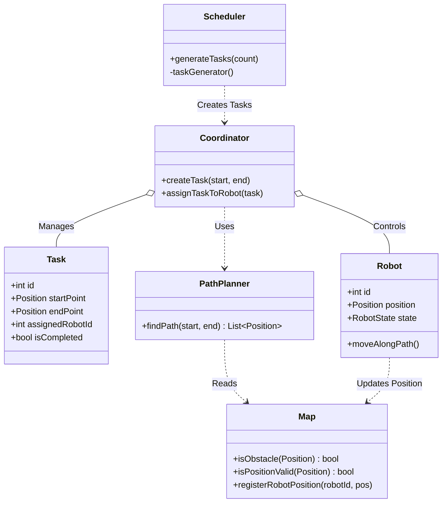
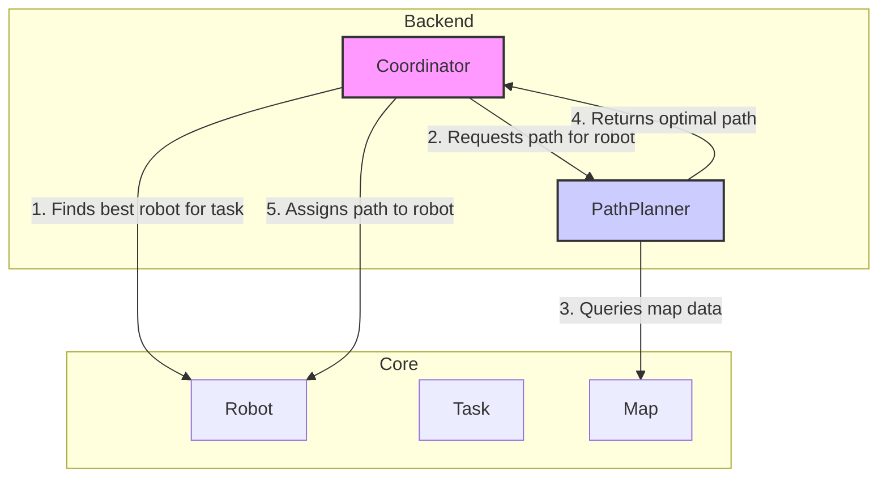
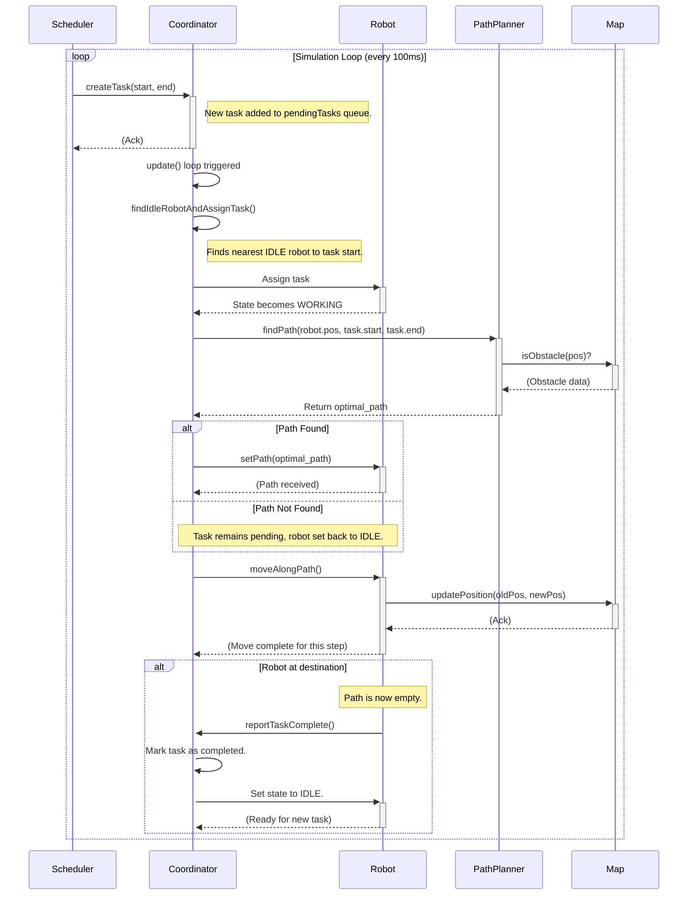
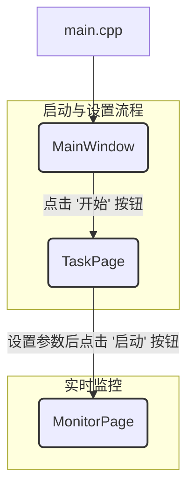

# RobotScheduler - 机器人调度与路径规划系统

`RobotScheduler` 是一个基于 C++ 和 Qt 实现的机器人调度与路径自动规划仿真系统。该系统能够在一个二维网格地图上模拟多个机器人接收任务、规划路径并执行移动任务的过程，同时实现了动态的障碍物躲避和机器人间的碰撞避免。

已经上传到：

```
https://github.com/GodLiangJingYu/RobotScheduler.git
```

## 系统架构

项目采用了清晰的分层架构，将核心逻辑、后端处理、前端UI和数据存储分离，主要包括以下几个部分：

1. **Core (核心层)**: 定义了系统的基本对象模型。
   - `Robot`: 机器人对象，包含ID、位置、状态（空闲、执行任务等）。
   - `Task`: 任务对象，包含起始点和终点。
   - `Map`: 全局地图，一个巨大的二维网格（`10000x10000`），负责管理障碍物和机器人位置。
   - `Scheduler`: 任务调度器，负责按设定的频率生成新的随机任务。
2. **Backend (后端)**: 负责主要的业务逻辑和算法实现。
   - `Coordinator`: **系统总协调器**，是整个系统的“大脑”。它负责管理所有机器人和任务队列，将待处理的任务分配给最合适的空闲机器人，并调用路径规划器为机器人生成路径。
   - `PathPlanner`: **路径规划器**，实现了核心的寻路功能。
3. **Frontend (前端)**: 基于 **Qt5** 构建的图形用户界面。
   - `MainWindow`， `TaskPage`: 提供用户交互界面，用于设置机器人数量、任务总数和障碍物数量，并启动仿真。
   - `MonitorPage`: **实时监控与可视化界面**。通过 `QPainter` 将地图、机器人、障碍物和规划路径实时绘制出来，动态展示整个系统的运行状态。
4. **Database (数据库)**:
   - `DatabaseManager`: 使用 **SQLite** 对机器人和任务数据进行持久化存储，可以将仿真过程中的状态保存到数据库中。

## Core (核心层) 概览

核心层定义了四个主要的类：`Robot`, `Task`, `Map`, 和 `Scheduler`。它们之间的关系可以用下面的图来表示：


### 1. `Map` 类

`Map` 类定义了机器人赖以生存的二维世界。它不仅包含了静态的障碍物信息，还实时追踪所有机器人的动态位置。

**职责**:
*   管理一个巨大的二维网格（`10000x10000`）。
*   存储和查询障碍物的位置。
*   注册、更新和注销机器人的实时位置。
*   提供位置有效性检查（是否越界或为障碍物）。

**关键实现细节**:
*   **空间网格**: 内部使用一个 `std::vector<std::vector<bool>> grid` 来表示地图，`true` 代表该坐标点是障碍物。
*   **机器人位置追踪**: 使用 `std::unordered_map<int, Position> robotPosMap` 来快速查询指定 ID 的机器人的位置。
*   **性能优化 - 空间分区 (Spatial Partitioning)**: 地图非常大，为了在路径规划和碰撞检测时快速查找一个区域内的机器人，您巧妙地使用了空间分区技术。地图被划分为 `1250x1250` 个区块（`BLOCK_SIZE = 8`），`blockRobots` 记录了每个区块内有哪些机器人。这样在检测碰撞时，无需遍历所有机器人，只需检查当前区块和邻近区块内的机器人即可，极大地提高了性能。

**伪代码: `registerRobotPosition`**
```pseudocode
function registerRobotPosition(robotId, position):
    // 1. 锁定互斥锁，保证线程安全
    lock mutex

    // 2. 更新机器人的位置映射
    robotPosMap[robotId] = position

    // 3. 计算机器人所在的大区块的索引
    blockX = position.x / BLOCK_SIZE
    blockY = position.y / BLOCK_SIZE

    // 4. 将机器人ID添加到对应区块的列表中
    if block is valid:
        blockRobots[blockX][blockY].add(robotId)

    // 5. 解锁
    unlock mutex
end function
```

### 2. `Robot` 类

`Robot` 类是系统中的执行单元，代表一个独立的机器人。

**职责**:

*   保存自身的状态，如 ID、当前位置、速度和工作状态（空闲、执行任务）。
*   根据 `PathPlanner` 规划好的路径进行移动。
*   向 `Map` 报告自己的位置更新。

**关键实现细节**:
*   **状态机 (State Machine)**: `Robot` 拥有一个 `RobotState` 枚举类型，至少包含 `IDLE`（空闲）和 `WORKING`（执行任务）等状态。这个状态是任务分配（`Coordinator`）的核心依据。
*   **路径跟随**: 每个机器人被分配任务后，会获得一个由 `Position` 组成的路径列表。在其 `update` 或 `move` 方法中，它会从路径列表中取出下一个点，更新自己的 `position` 属性，并通知 `Map` 自己的位置发生了变化。

**伪代码: `moveAlongPath`**
```pseudocode
class Robot:
    path: List<Position>
    currentPosition: Position

    function moveAlongPath():
        // 1. 如果路径为空，说明已到达终点
        if path is empty:
            state = IDLE
            current_task_id = -1
            return

        // 2. 取出路径上的下一个目标点
        nextPosition = path.front()
        path.pop_front()

        // 3. (可选) 可以模拟更平滑的移动，而不是瞬移
        // 例如：计算朝向 nextPosition 的一个单位步长
        // currentPosition = currentPosition + step_towards(nextPosition)

        // 4. 这里简化为直接移动到下一个点
        previousPosition = currentPosition
        currentPosition = nextPosition

        // 5. 通知地图位置已更新
        map.unregisterRobotPosition(id, previousPosition)
        map.registerRobotPosition(id, currentPosition)
    end function
```

### 3. `Task` 类

`Task` 是一个简单的数据结构，用于定义一个工作单元。

**职责**:
*   描述一个任务，包含唯一的 `id`、`startPoint`（起点）和 `endPoint`（终点）。
*   记录任务的状态，例如是否被分配 (`assignedRobotId`) 和是否已完成 (`isCompleted`)。

**伪代码: 构造函数**
```pseudocode
class Task:
    id: int
    startPoint: Position
    endPoint: Position
    assignedRobotId: int
    isCompleted: bool
    createdTime: time

    constructor Task(id, start, end):
        this.id = id
        this.startPoint = start
        this.endPoint = end
        this.assignedRobotId = -1  // -1 表示未分配
        this.isCompleted = false
        this.createdTime = now()
    end constructor
```
它的逻辑非常直接，主要是作为 `Scheduler` 和 `Coordinator` 之间传递信息的载体。

### 4. `Scheduler` 类

`Scheduler` 扮演着“任务发布者”的角色，它模拟了外部世界持续不断下发新任务的场景。

**职责**:

*   在一个独立的线程中运行，以避免阻塞主线程（UI线程）。
*   根据设定的总任务数 (`totalTasks`)，按一定的时间间隔（例如每秒1个）生成新的随机任务。
*   调用 `Coordinator` 的接口将新创建的任务加入到待处理队列中。

**关键实现细节**:
*   **多线程**: `Scheduler` 的核心 `taskGenerator` 方法在一个独立的 `std::thread` 中运行。使用 `std::atomic<bool> running` 变量来控制线程的启停。
*   **任务生成**: 它使用 C++ 的 `<random>` 库在 `Map` 的有效范围内生成随机的起点和终点，并确保这些点不是障碍物。

**伪代码: `taskGenerator`**
```pseudocode
function taskGenerator():
    while running and generatedTasks < totalTasks:
        // 1. 生成随机的起点和终点
        startPos = generate_random_position()
        endPos = generate_random_position()

        // 2. 验证坐标点的有效性
        if map.isValidPosition(startPos) and map.isValidPosition(endPos):
            // 3. 如果有效，则创建任务并通知协调器
            coordinator.createTask(startPos, endPos)
            generatedTasks++

        // 4. 等待一段时间再生成下一个任务
        sleep(1 second)
    end while
end function
```

好的，我们来深入剖析您项目中最核心的部分——**Backend (后端)**。后端是整个机器人调度系统的“大脑”和“决策中心”，负责将 `Core` 层定义的数据模型驱动起来，执行复杂的业务逻辑和算法。

## Backend (后端)

后端由两个关键组件构成：`PathPlanner`（路径规划器）和 `Coordinator`（总协调器）。它们一个负责“怎么走”（微观路径），一个负责“谁去走”和“什么时间走”（宏观调度）。

它们之间的协作关系如下：



### 1. `PathPlanner` - 路径规划器

`PathPlanner` 的职责非常专一且关键：**在给定起点、终点和地图信息的情况下，计算出一条最优（通常是最短）且无碰撞的路径**。

#### 算法核心：A* 寻路算法

*   **评估函数**: `f(n) = g(n) + h(n)`
    *   `g(n)`: 从起点到当前节点 `n` 的**实际代价**。在网格图中，这通常就是移动的步数。
    *   `h(n)`: 从当前节点 `n` 到终点的**估算代价**（启发函数）。您使用了**欧几里得距离**（两点直线距离），这是一个非常好的选择，因为它能保证找到最短路径（因为估算值不会超过实际最短距离，是“可接受的”启发函数）。

#### 实现细节与伪代码

`PathPlanner` 的核心是 `findPath` 方法。下面是其详细的伪代码实现，揭示了算法的每一步：

```pseudocode
function findPath(startPos, endPos, map):
    // 1. 初始化数据结构
    // openSet: 优先队列，存储待探索的节点，按 f(n) 值从小到大排序
    openSet = new PriorityQueue()
    openSet.add(startPos, 0)

    // cameFrom: 哈希表，记录路径，key 是节点，value 是它的父节点
    cameFrom = new HashMap()

    // gScore: 哈希表，存储从起点到各节点的 g(n) 值
    gScore = new HashMap()
    gScore[startPos] = 0

    // fScore: 哈希表，存储各节点的 f(n) 值
    fScore = new HashMap()
    fScore[startPos] = heuristic(startPos, endPos)

    // 2. 主循环：只要还有待探索的节点
    while openSet is not empty:
        // 2.1. 从 openSet 中取出 f(n) 值最小的节点
        current = openSet.pop_smallest()

        // 2.2. 如果到达终点，回溯路径并返回
        if current == endPos:
            return reconstructPath(cameFrom, current)

        // 2.3. 遍历当前节点的邻居（上、下、左、右、以及对角线等8个方向）
        for each neighbor in getNeighbors(current):
            // 2.3.1. 检查邻居是否有效：不能是障碍物或越界
            if map.isObstacle(neighbor) or not map.isValidPosition(neighbor):
                continue // 跳过无效邻居

            // 2.3.2. 计算从起点经过 current 到达 neighbor 的 g(n) 值
            tentative_gScore = gScore[current] + distance(current, neighbor)

            // 2.3.3. 如果这条路径更优
            if tentative_gScore < gScore.getOrDefault(neighbor, infinity):
                // 更新路径信息
                cameFrom[neighbor] = current
                gScore[neighbor] = tentative_gScore
                fScore[neighbor] = tentative_gScore + heuristic(neighbor, endPos)

                // 如果 neighbor 不在 openSet 中，则加入
                if not openSet.contains(neighbor):
                    openSet.add(neighbor, fScore[neighbor])

    // 3. 如果 openSet 为空仍未找到终点，说明路径不存在
    return empty_path // 返回空路径
end function

function reconstructPath(cameFrom, current):
    path = new List()
    path.add_front(current)
    while current in cameFrom:
        current = cameFrom[current]
        path.add_front(current)
    return path
end function
```

**动态避障 (Collision Avoidance)**: 更高级的 `PathPlanner` 还会考虑动态障碍物（即其他机器人）。在 `2.3.1` 检查邻居有效性时，除了检查静态障碍物，还会预测在机器人到达 `neighbor` 的时间点 `t`，该位置是否已被其他机器人预定。这通常需要 `Coordinator` 提供所有机器人的未来路径信息。

### 2. `Coordinator` - 系统总协调器

`Coordinator` 是整个系统的中枢神经。它不执行具体的寻路计算，但它**决策、调度和监控**所有事件的发生。

#### 核心职责

1.  **状态管理**:
    *   维护所有机器人列表 (`std::vector<Robot>`) 和任务列表（如 `pendingTasks`, `completedTasks`）。

2.  **任务分配 (Task Assignment)**:
    *   当 `Scheduler` 创建一个新任务时，`Coordinator` 会收到通知。
    *   它会遍历所有处于 `IDLE`（空闲）状态的机器人。
    *   计算每个空闲机器人当前位置到任务**起始点**的距离。
    *   选择**距离最近**的那个机器人，将任务分配给它。这个“就近原则”是提高系统效率的关键策略。

3.  **路径请求与执行**:
    *   任务分配后，`Coordinator` 会立即为该机器人调用 `PathPlanner::findPath`，请求一条从机器人当前位置到任务起点，再到任务终点的完整路径。
    *   获取到路径后，将路径设置给机器人，并将其状态更新为 `WORKING`。

4.  **仿真循环 (Update Loop)**:
    *   `Coordinator` 包含一个主更新循环（`update` 方法），由一个定时器（如 `QTimer`）以固定的时间间隔（例如 100 毫秒）触发。
    *   在每次 `update` 中，它会遍历所有机器人：
        *   如果机器人状态为 `WORKING`，则命令其沿着路径移动一步 (`robot->moveAlongPath()`)。
        *   检查机器人是否已完成路径移动。如果完成，则更新机器人和任务的状态（例如，将机器人设为 `IDLE`，任务设为 `completed`）。
    *   每次 `update` 循环的最后，它会重新尝试为等待队列中的任务分配机器人。

#### 任务分配与执行的序列图

下面这个序列图清晰地展示了一个任务从创建到完成的全过程：



### 3. 路径规划算法实现过程 (`PathPlanner`)

#### **目标**

在给定的 `Map` 上，找到从机器人当前位置到任务终点（或起点）的，绕过所有障碍物的最短路径。

#### **核心数据结构**

在 `PathPlanner::findPath` 函数内部，A* 算法依赖于以下几个关键的数据结构：

1. `open_set` (**开放列表**): 一个**优先队列** (`std::priority_queue`)。它存储了所有已被发现但尚未被完全探索的节点。节点按照它们的 `f_score` 值进行排序，`f_score` 最小的节点会被优先处理。这确保了算法总是沿着最有希望的方向进行探索。
2. `came_from` (**来源图**): 一个**哈希表** (`std::unordered_map<Position, Position>`)。它记录了到达每个节点的最佳路径上的前一个节点。例如 `came_from[B] = A` 意味着从 A 到 B 是最优路径的一部分。这个数据结构是最终回溯生成路径的关键。
3. `g_score` (**移动代价**): 一个**哈希表** (`std::unordered_map<Position, double>`)。它存储了从**起点**到图中每个节点的已知最短路径的实际代价（距离）。
4. `f_score` (**预估总代价**): 一个**哈希表** (`std::unordered_map<Position, double>`)。它存储了每个节点的预估总代价，即 `f_score[n] = g_score[n] + h(n)`，其中 `h(n)` 是从节点 `n` 到终点的启发式估算距离（您代码中为欧几里得距离）。

#### **算法执行步骤 (伪代码)**

下面是 `findPath` 函数的详细执行流程：

```pseudocode
function findPath(start, end, map):
    // 1. 初始化
    open_set = new PriorityQueue()
    open_set.push(start, 0) // 将起点放入开放列表，优先级为0

    came_from = new Map()

    g_score = new Map()
    g_score.set(start, 0) // 起点的g_score为0

    f_score = new Map()
    f_score.set(start, heuristic(start, end)) // 起点的f_score为启发函数估值

    // 2. 主循环：只要开放列表不为空
    while open_set is not empty:
        // 2.1. 从开放列表中取出 f_score 最低的节点
        current = open_set.pop()

        // 2.2. 检查是否到达终点
        if current == end:
            // 到达终点，通过 came_from 回溯路径并返回
            return reconstruct_path(came_from, current)

        // 2.3. 探索当前节点的邻居（8个方向：上下左右及对角线）
        for each neighbor in get_neighbors(current):
            // 2.3.1. 障碍物检查
            // 这是算法与地图交互的关键点
            if map.isObstacle(neighbor) == true:
                continue // 如果邻居是障碍物，则跳过

            // 2.3.2. 计算经由 current 到达 neighbor 的 g_score
            // distance() 会计算两点间的距离（直线为1，对角线为约1.414）
            tentative_g_score = g_score.get(current) + distance(current, neighbor)

            // 2.3.3. 发现更优路径
            // 如果新路径的 g_score < 已知的 g_score (或未知)
            if tentative_g_score < g_score.getOrDefault(neighbor, infinity):
                // 这条路更近！记录下来！
                came_from.set(neighbor, current)
                g_score.set(neighbor, tentative_g_score)
                f_score.set(neighbor, tentative_g_score + heuristic(neighbor, end))

                // 2.3.4. 将邻居加入开放列表（如果它不在里面的话）
                if open_set.contains(neighbor) == false:
                    open_set.push(neighbor, f_score.get(neighbor))

    // 3. 循环结束仍未找到终点，说明路径不存在
    return empty_path
```

这个过程就像是在地图上泛起的一圈圈涟漪，但它不是盲目扩散，而是**智能地朝向终点方向扩散**，从而保证了效率和最优性。

### 4. 任务调度算法实现过程 (`Coordinator`)

`Coordinator` 的算法决定了整个系统的宏观运行效率。它的核心是**任务分配策略**和**状态驱动的仿真循环**。

#### **目标**

将待处理的任务 (`pendingTasks`) 高效、合理地分配给空闲的 (`IDLE`) 机器人。

#### **核心数据结构**

- `robots`: 一个 `std::vector`，存储系统中所有的机器人对象。
- `pendingTasks`: 一个 `std::deque` 或 `std::vector`，作为待处理任务的队列。

#### **算法执行步骤**

`Coordinator` 的调度逻辑主要在其周期性调用的 `update()` 方法中体现。

**Part 1: 任务分配 (Assigning Tasks)**

```pseudocode
procedure assignTasks():
    // 1. 如果没有待处理任务，直接返回
    if pendingTasks is empty:
        return

    // 2. 遍历所有待处理的任务
    for each task in pendingTasks:
        best_robot = null
        min_distance = infinity

        // 3. 寻找最适合执行该任务的机器人
        // 遍历系统中所有的机器人
        for each robot in all_robots:
            // 3.1. 条件筛选：只考虑空闲的机器人
            if robot.getState() == IDLE:
                // 3.2. 评估策略：计算机器人到任务起点的距离
                distance_to_task = distance(robot.getPosition(), task.getStartPoint())

                // 3.3. "就近原则"：如果当前机器人更近，则选它
                if distance_to_task < min_distance:
                    min_distance = distance_to_task
                    best_robot = robot

        // 4. 分配任务
        // 如果找到了合适的机器人
        if best_robot is not null:
            // 4.1. 调用路径规划器获取路径
            path_to_start = PathPlanner.findPath(best_robot.getPosition(), task.getStartPoint())
            path_from_start_to_end = PathPlanner.findPath(task.getStartPoint(), task.getEndPoint())
            
            // 如果两条路径都成功找到
            if path_to_start is valid and path_from_start_to_end is valid:
                // 合并路径
                full_path = combine(path_to_start, path_from_start_to_end)

                // 4.2. 正式分配
                best_robot.setTask(task, full_path)
                best_robot.setState(WORKING) // 状态变更为“工作中”
                
                task.setAssigned(best_robot.getId())
                remove task from pendingTasks // 将任务从待处理队列中移除
```

这个**“就近分配”**策略非常关键，它确保了机器人不会“舍近求远”，从而最小化了机器人从空闲位置到任务起点的空驶距离，提升了整个系统的效率。

**Part 2: 仿真推进 (Advancing Simulation)**

在 `update()` 方法的另一部分，`Coordinator` 负责驱动所有正在工作的机器人。

```pseudocode
procedure advanceRobots():
    // 遍历所有机器人
    for each robot in all_robots:
        // 只关心正在执行任务的机器人
        if robot.getState() == WORKING:
            // 命令机器人沿着其内部路径移动一步
            robot.moveAlongPath()

            // 检查任务是否完成
            if robot.isPathComplete():
                // 任务完成，重置机器人状态
                robot.setState(IDLE)
                
                // 标记任务已完成
                task = robot.getCurrentTask()
                task.setCompleted(true)
```

这个循环确保了仿真的动态性，每调用一次 `update`，所有工作中的机器人就向前移动一步，直到它们到达各自的目的地。

## Frontend（前端）

前端主要由三个窗口/页面类构成，它们共同完成从参数设置到实时监控的完整流程。



### 1. `MainWindow` 和 `TaskPage` - 仿真参数设置

这两个类构成了仿真的“启动器”，负责收集用户输入的初始参数。

#### `MainWindow`类

- **角色**: 程序入口窗口。
- **功能**: 通常它比较简单，包含一个欢迎界面和一个“开始设置”按钮。当用户点击按钮时，它会隐藏或关闭自身，并创建和显示 `TaskPage` 实例，将程序流程引导至下一步。

#### `TaskPage`类

- **角色**: 核心参数配置页面。
- **UI 布局**:
  - 使用 `QFormLayout` 或 `QGridLayout` 来整齐地排列标签和输入框。
  - **机器人数量**: `QSpinBox` 或 `QLineEdit` 用于输入初始机器人数量。
  - **任务总数**: `QSpinBox` 或 `QLineEdit` 用于设置仿真需要生成的总任务数。
  - **障碍物数量**: `QSpinBox` 或 `QLineEdit` 用于在地图上随机生成障碍物的数量。
  - **启动按钮**: 一个 `QPushButton` ("启动仿真")。
- **核心逻辑**: 当用户填写完所有参数并点击“启动仿真”按钮时，会触发一个槽函数 (Slot)，例如 `onStartClicked()`。这个函数是连接设置与仿真的桥梁。

`onStartClicked()` 

```pseudocode
function onStartClicked():
    // 1. 读取用户输入的参数
    num_robots = robot_spinbox.value()
    num_tasks = task_spinbox.value()
    num_obstacles = obstacle_spinbox.value()

    // 2. 初始化后端和核心层组件
    // 这是一个关键步骤，根据用户输入实例化系统
    map = new Map()
    map.generateRandomObstacles(num_obstacles)

    coordinator = new Coordinator(map)
    coordinator.createInitialRobots(num_robots)
    
    scheduler = new Scheduler(coordinator, map)
    scheduler.generateTasks(num_tasks) // 告诉调度器总共要生成多少任务

    // 3. 创建并显示监控页面
    // 将初始化好的核心组件指针传递给 MonitorPage
    monitor_page = new MonitorPage(map, coordinator, num_tasks)
    monitor_page.show()

    // 4. 启动后端逻辑
    scheduler.start() // 启动任务生成线程
    coordinator.start() // 启动主更新循环

    // 5. 关闭当前设置页面
    this.close()
```

通过这个流程，前端成功地将用户的配置转化为了一个正在运行的后端仿真实例。

### 2. `MonitorPage` - 实时监控与可视化界面

#### **核心技术：`QPainter` 和 `paintEvent`**

Qt 中所有的自定义绘制都发生在 `paintEvent` 这个虚函数中。当窗口需要重绘时（例如，窗口大小改变、被其他窗口遮挡后重新显示，或被手动触发），这个函数就会被调用。`MonitorPage` 正是利用了这一点来实现动态刷新。

#### **动态刷新的实现原理**

1. **`QTimer`**: 在 `MonitorPage` 的构造函数中，您创建了一个 `QTimer` 对象 (`updateTimer`)。
2. **设置定时器**: 设置定时器的超时时间，例如 `100` 毫秒。这意味着 `QTimer` 每秒会发出 `10` 次 `timeout()` 信号。
3. **连接信号与槽**: 将 `updateTimer->timeout()` 信号连接到一个自定义的槽函数，例如 `updateDisplay()`。
4. **手动触发重绘**: 在 `updateDisplay()` 槽函数中，只有一行核心代码：`this->update()`。这个函数**不会**立即调用 `paintEvent`，而是向 Qt 的事件循环发送一个“重绘请求”。Qt 会在适当的时机（通常是事件循环的下一次迭代）高效地调用 `paintEvent`。

这个机制构成了整个监控页面的动画循环： `QTimer timeout()` -> `updateDisplay()` -> `update()` -> `paintEvent()`

#### **`paintEvent` 绘制流程**

当 `paintEvent` 被调用时，它会像一个画家一样，一层一层地在画布（`QWidget`）上进行绘制。

**`paintEvent` 伪代码:**

```pseudocode
function paintEvent(event):
    // 1. 创建 QPainter 对象，指定在本窗口上绘制
    painter = new QPainter(this)

    // 2. (可选) 开启抗锯齿，使图形更平滑
    painter.setRenderHint(QPainter::Antialiasing)

    // 3. 进行坐标变换
    // 为了将巨大的地图坐标(10000x10000)适配到较小的窗口像素坐标(如 800x800)
    // 需要进行缩放和平移
    painter.scale(SCALE_FACTOR, SCALE_FACTOR) // 例如缩小到 5%
    // painter.translate(...) // 可选，用于平移视图

    // 4. 按层级绘制不同元素
    drawGrid(painter)      // 绘制背景网格
    drawObstacles(painter) // 绘制障碍物
    drawTasks(painter)     // 绘制任务的起点和终点
    drawRobotPaths(painter)// 绘制每个机器人正在执行的路径
    drawRobots(painter)    // 绘制机器人本身（通常在最上层）

    // 5. 绘制 UI 信息（这部分通常在坐标变换之外，使用原始窗口坐标）
    // ...绘制状态栏、进度条等...
```

**各绘制函数的细节:**

- `drawObstacles(painter)`:
  - 调用 `map->getObstacles()` 获取所有障碍物的位置列表。
  - 遍历列表，为每个障碍物位置 `pos` 调用 `painter.fillRect(pos.x, pos.y, OBSTACLE_SIZE, OBSTACLE_SIZE, Qt::gray)`。
- `drawRobotPaths(painter)`:
  - 遍历 `coordinator->getRobots()`。
  - 如果机器人状态为 `WORKING`，则获取其路径 `robot->getPath()`。
  - 设置画笔 `painter.setPen(QPen(Qt::green, 1))`。
  - 使用 `painter.drawPolyline()` 或遍历路径点并使用 `painter.drawLine()` 绘制出整条路径。
- `drawRobots(painter)`:
  - 调用 `coordinator->getRobotPositions()` 获取所有机器人的 ID 和实时位置。
  - 遍历列表，根据机器人状态设置不同颜色（例如，空闲为蓝色，工作为红色）。
  - 在机器人位置 `pos` 调用 `painter.fillRect(pos.x, pos.y, ROBOT_SIZE, ROBOT_SIZE, color)`。
  - (可选) 可以在机器人旁边绘制其 ID: `painter.drawText(pos.x, pos.y, QString::number(robot_id))`。

#### **用户交互**

`MonitorPage` 还提供了一些控制仿真的 UI 元素：

- **暂停/继续按钮**: 点击时，会调用 `coordinator->pause()` 或 `coordinator->resume()`，同时也会停止或启动 `updateTimer`，从而冻结或恢复整个仿真画面。
- **速度滑块**: 改变其值会调用一个槽函数，该函数会调整 `updateTimer` 的间隔（例如，值越大，间隔越短，画面刷新越快），从而实现仿真速度的调节。
- **状态显示**: 页面上还有多个 `QLabel`，在 `updateDisplay()` 中，它们会从 `Coordinator` 获取最新的数据（如待处理任务数、已完成任务数）并更新文本，为用户提供实时的统计信息。

## Database (数据库) 概览

**核心技术**:

- **SQLite**: 一个轻量级的、基于文件的、无服务器的、自包含的 SQL 数据库引擎。它非常适合嵌入到桌面应用程序中，因为它不需要独立的数据库服务器进程，所有数据都存储在一个单一的文件（例如 `robots_database.db`）中，易于部署和管理。
- **SQLite C API**: 您通过 C++ 代码直接调用 SQLite 官方提供的 C 语言接口（如 `sqlite3_open`， `sqlite3_exec`， `sqlite3_close` 等）来与数据库进行交互。

**在系统中的角色**: `DatabaseManager` 就像是系统的“日志记录员”或“档案管理员”。它与核心业务逻辑（`Coordinator`）松散地耦合，在关键事件发生时被调用，以记录状态变化。

```Mermaid
graph TD
    subgraph Backend
        Coordinator
    end

    subgraph Database
        DatabaseManager
    end

    subgraph "Hard Drive"
        B["robots_database.db"]
    end

    Coordinator -- "关键事件发生时 (如机器人移动, 任务完成)" --> DatabaseManager;
    DatabaseManager -- "执行 SQL 语句" --> B;

    style DatabaseManager fill:#f9d,stroke:#333,stroke-width:2px
    style B fill:#ccc,stroke:#333,stroke-width:2px
```

### `DatabaseManager` 类的详细解析

#### 1. 职责

- **初始化与连接**: 负责打开（或创建）一个 SQLite 数据库文件，并建立与该文件的连接。
- **表结构管理**: 在数据库首次创建时，自动执行 SQL DDL (Data Definition Language) 语句来创建所需的表结构（如 `robots` 表和 `tasks` 表）。
- **数据操作 (CRUD)**: 提供一系列的公共接口方法，用于对数据库进行增 (Create)、删 (Delete)、改 (Update)、查 (Read) 操作。例如 `insertRobot`， `updateRobotPosition`， `insertTask` 等。
- **封装 SQL**: 将底层的、基于字符串的 SQL 查询语句封装成语义清晰的 C++ 方法，使得后端业务逻辑无需关心具体的 SQL 语法。
- **连接管理**: 确保在程序结束时能安全地关闭数据库连接，释放资源。

#### 2. 表结构设计 (`createTables`)

在您的 `DatabaseManager.cpp` 中，`createTables` 方法定义了数据库的核心模式 (Schema)。

**`robots` 表**: 这张表用于存储每个机器人的静态信息和最新的动态状态。

```sql
CREATE TABLE IF NOT EXISTS robots (
    id INTEGER PRIMARY KEY,        -- 机器人唯一ID
    type TEXT NOT NULL,            -- 机器人类型 (虽然当前可能只有一种)
    position_x INTEGER NOT NULL,   -- 当前X坐标
    position_y INTEGER NOT NULL,   -- 当前Y坐标
    state INTEGER NOT NULL,        -- 当前状态 (如 0: IDLE, 1: WORKING)
    current_task_id INTEGER DEFAULT -1 -- 当前执行的任务ID, -1表示无任务
);
```

**`tasks` 表**: 这张表用于记录所有被创建的任务，无论是待处理、进行中还是已完成。

```sql
CREATE TABLE IF NOT EXISTS tasks (
    id INTEGER PRIMARY KEY,           -- 任务唯一ID
    start_x INTEGER NOT NULL,         -- 任务起点X坐标
    start_y INTEGER NOT NULL,         -- 任务起点Y坐标
    end_x INTEGER NOT NULL,           -- 任务终点X坐标
    end_y INTEGER NOT NULL,           -- 任务终点Y坐标
    assigned_robot_id INTEGER DEFAULT -1, -- 被分配给哪个机器人, -1表示未分配
    is_completed BOOLEAN DEFAULT 0,   -- 是否完成 (0: 否, 1: 是)
    created_time TEXT NOT NULL      -- 任务创建时间戳
);
```

`CREATE TABLE IF NOT EXISTS` 是一个很好的实践，它确保了即使重复调用 `createTables` 方法也不会导致程序因表已存在而崩溃。

#### 3. 核心方法实现 (伪代码)

**初始化 (`initialize`)**:

```pseudocode
function initialize(database_path):
    // 1. 尝试打开数据库文件，如果文件不存在则自动创建
    result = sqlite3_open(database_path, &db_handle)

    // 2. 检查连接是否成功
    if result is not OK:
        print_error("无法打开数据库: " + sqlite3_errmsg(db_handle))
        return false

    // 3. 连接成功后，立即创建表结构
    createTables()
    
    return true
```

**执行通用查询 (`executeQuery`)**: 这是一个非常重要的辅助方法，它封装了 `sqlite3_exec` 的调用，用于执行不返回结果集的 SQL 语句（如 `INSERT`， `UPDATE`， `CREATE`）。

```pseudocode
function executeQuery(sql_string):
    error_message = null
    result = sqlite3_exec(db_handle, sql_string, callback=null, callback_arg=null, &error_message)

    if result is not OK:
        print_error("SQL 执行失败: " + error_message)
        sqlite3_free(error_message) // 必须释放错误信息占用的内存
        return false

    return true
```

**插入机器人 (`insertRobot`)**: 这个方法展示了如何将一个 C++ 对象 (`Robot`) 的数据转化成一条 `INSERT` SQL 语句。

```pseudocode
function insertRobot(robot_object):
    // 1. 从 C++ 对象中提取数据
    id = robot_object.getId()
    type_str = Robot::typeToString(robot_object.getType())
    pos_x = robot_object.getPosition().x
    // ... 其他属性

    // 2. 动态构建 SQL 字符串
    // 注意：在实际生产代码中，为了防止SQL注入，应使用预处理语句 (prepared statements)
    // 但对于内部可信数据，字符串拼接是简单直接的方法。
    sql = "INSERT INTO robots (id, type, position_x, ...) VALUES (" +
          id + ", '" + type_str + "', " + pos_x + ", ...);"

    // 3. 调用通用执行方法
    return executeQuery(sql)
```

**更新机器人位置 (`updateRobotPosition`)**: 当 `Coordinator` 在 `update` 循环中移动了一个机器人后，就会调用这个方法。这是**最高频**的数据库操作之一。

```pseudocode
function updateRobotPosition(robotId, new_position):
    // 动态构建 UPDATE SQL 语句
    sql = "UPDATE robots SET " +
          "position_x = " + new_position.x + ", " +
          "position_y = " + new_position.y + " " +
          "WHERE id = " + robotId + ";"

    return executeQuery(sql)
```

#### **集成到系统中**

`DatabaseManager` 在 `Coordinator` 中被实例化，并在关键的业务逻辑点被调用：

1. 仿真开始时:
   - `Coordinator::createInitialRobots()`: 每创建一个 `Robot` 对象，就立即调用 `dbManager->insertRobot()` 将其初始状态存入数据库。
2. 仿真进行中:
   - `Coordinator::update()` -> `robot->moveAlongPath()`: 在机器人位置更新后，调用 `dbManager->updateRobotPosition()`。
   - `Coordinator::assignTask()`: 当一个任务被分配给机器人时，调用 `dbManager->updateTaskAssignment(taskId, robotId)` 和 `dbManager->updateRobotState(robotId, WORKING)`。
3. 任务完成时:
   - 当机器人到达终点时，调用 `dbManager->updateTaskCompleted(taskId)` 和 `dbManager->updateRobotState(robotId, IDLE)`。

## 可优化的方向

### 1. 后端与算法优化

这是最能提升系统核心价值的部分。

- **动态碰撞规避 (Dynamic Collision Avoidance)**
  - **问题**: 当前的A*算法主要规避静态障碍物。当两个机器人路径交叉时，它们可能会在同一时间到达同一点而发生碰撞。
  - **优化方向**: 引入时间维度，将路径规划从二维空间(x, y)升级到三维时空。
    1. **预留路径**: 当 `Coordinator` 为一个机器人规划好路径后，将该路径的 `(位置, 时间)` 序列注册到一个“时空预留表”中。
    2. **时空A\***: `PathPlanner` 在寻找路径时，不仅要检查 `map.isObstacle(neighbor)`，还要查询“时空预留表”，检查 `isReserved(neighbor, time_to_reach)`。如果邻近节点在机器人即将到达的时间已被其他机器人预定，则视其为临时障碍物，从而在规划阶段就主动绕开。
  - **效果**: 这是实现真正意义上多机器人协同工作的关键，能从根本上避免机器人运行时的冲突和等待。
- **更高级的任务调度策略 (Advanced Scheduling)**
  - **问题**: “就近分配”是一个优秀的贪心策略，但在某些复杂场景下可能不是全局最优。
  - **优化方向**:
    1. **任务拍卖 (Task Auctioning)**: 当有多个任务和多个空闲机器人时，`Coordinator` 可以发起一次“拍卖”。每个机器人根据自身到任务起点、再到终点的总成本（距离、预计耗时等）进行“竞标”，`Coordinator` 选择总成本最低的“机器人-任务”组合。
    2. **任务链 (Task Chaining)**: 考虑任务的终点。一个空闲机器人虽然离A任务起点远，但它可能正好在B任务的起点附近。如果它能连续执行A和B，总体的空驶时间可能会更少。
- **路径平滑处理 (Path Smoothing)**
  - **问题**: A*在网格地图上生成的路径通常是锯齿状的，看起来不自然。
  - **优化方向**: 在`PathPlanner`返回路径后，增加一个后处理步骤。使用 **B样条（B-spline）** 或 **贝塞尔曲线（Bézier curves）** 算法，以A*的路径点作为控制点，生成一条平滑、曲率连续的曲线路径。机器人在移动时沿这条曲线运动，视觉效果会大幅提升。

### 2. 性能与并发优化

- **并发路径规划 (Concurrent Path Planning)**
  - **问题**: 如果同一时间有大量任务需要分配，`Coordinator` 会连续多次调用 `findPath`，由于A*计算量较大，可能会造成短暂的阻塞。
  - **优化方向**: 使用**线程池**来处理路径规划请求。`Coordinator` 将规划任务（起点、终点）提交给线程池，然后可以继续处理其他逻辑。当路径计算完成后，通过回调或 `std::future` 将路径返回给`Coordinator`，再分配给机器人。
- **数据库操作优化 (Database Optimization)**
  - **问题**: `updateRobotPosition` 是一个高频操作，每次移动都写入数据库会产生巨大的I/O开销。
  - **优化方向**:
    1. **批量写入/缓存 (Batch Writing/Caching)**: 在`DatabaseManager`中增加一个缓存区，将短时间内多个 `UPDATE` 或 `INSERT` 语句合并成一个**事务（Transaction）**，再一次性提交给数据库。例如，每隔1-2秒或当缓存的SQL语句达到一定数量时，才真正执行数据库写入。
    2. **使用预处理语句 (Prepared Statements)**: 为了防止SQL注入并提高重复执行SQL的效率，应将动态拼接SQL字符串的方式，改为使用 `sqlite3_prepare_v2` 和 `sqlite3_bind_*` 系列函数的预处理语句。

### 3. 健壮性与可扩展性优化

- **死锁检测与恢复 (Deadlock Detection & Resolution)**
  - **问题**: 即使有动态避障，在狭窄通道等极端情况下，机器人也可能陷入“互相谦让”或“对峙”的死锁状态。
  - **优化方向**: `Coordinator` 可以增加一个监控机制，如果一个 `WORKING` 状态的机器人连续N个更新周期位置都没有变化，则判定其可能陷入死锁。此时，可以强制其中一个机器人（例如ID较低的）重新规划一条成本更高的绕行路径，打破僵局。
- **配置化 (Configuration)**
  - **问题**: 地图大小（10000x10000）、区块大小（8）等魔法数字（Magic Numbers）硬编码在代码中。
  - **优化方向**: 将这些参数提取到配置文件（如 `.ini`， `.json`， `.yaml`）中，程序启动时读取。这样在不重新编译的情况下，就能轻松调整仿真世界的各种参数，极大提高了灵活性。